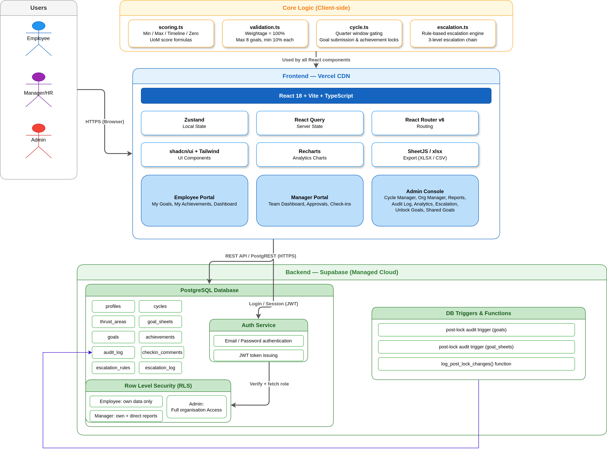

# AtomQuest — Goal Setting & Tracking Portal

Production-grade full-stack web application for employee goal management, quarterly achievement tracking, manager approvals, and analytics.

**Live Demo**: https://goalpilot-two.vercel.app/

## Architecture



Source: `docs/architecture.drawio` — open in draw.io to edit or export.

### Data Flow

| Action | Flow |
|---|---|
| Goal Create | Employee → GoalForm (zod validate) → `goals` table → audit trigger fires |
| Goal Approve | Manager → ApprovalCard (inline edit) → `goal_sheets.status = 'approved'` → sheet locked |
| Achievement | Employee → AchievementRow (score preview) → `achievements` table → sync trigger propagates to shared goals |
| Check-in | Manager → CheckinModal → `checkin_comments` table |
| Escalation | Admin → Run scan → `runEscalationScan()` → `escalation_log` upsert |
| Export | Admin → Reports → `exportToXlsx` / `exportToCsv` → browser download |

## Demo Credentials

| Email | Password | Role | What to Show |
|---|---|---|---|
| admin@demo.com | Admin@123 | admin | Dashboard, Analytics, Reports, Audit Log, Cycle/Org Manager, Unlock Goals |
| manager1@demo.com | Manager@123 | manager | Team Dashboard, Approval Queue, Check-ins (Engineering team) |
| manager2@demo.com | Manager@123 | manager | Team Dashboard, Approval Queue, Check-ins (Sales team) |
| emp1@demo.com | Employee@123 | employee | My Goals, My Achievements (Ananya — Engineering) |
| emp2@demo.com | Employee@123 | employee | My Goals, My Achievements (Vikram — Engineering) |
| emp3@demo.com | Employee@123 | employee | My Goals, My Achievements (Sneha — Sales) |
| emp4@demo.com | Employee@123 | employee | My Goals, My Achievements (Arjun — Sales) |

## Demo Walkthrough

1. **Login as employee** → Dashboard shows goal status, Q1 (May–Aug) window open, progress scores, recent activity
2. **My Achievements** → Q1 data filled for all 4 employees (18 achievements across all UoM types)
3. **Login as manager** → Team Dashboard shows check-in progress, team scores sorted worst→best
4. **Approval Queue** → Review and approve/return goal sheets with inline weightage editing
5. **Check-ins** → View team achievements by quarter, add manager comments
6. **Login as admin** → Org stats (4 employees, 4 approved), Q1 completion rate, department summary, audit log
7. **Analytics** → QoQ trends (Engineering + Sales lines), heatmap (all 4 employees), goal distribution pie, manager effectiveness bars
8. **Reports** → Filter by department/quarter, export to XLSX or CSV
9. **Audit Log** → Red strikethrough → green diff view with employee names resolved
10. **Unlock Goals** → Admin can revert approved/locked sheets to editable state
11. **Cycle Manager** → Create/edit cycles, set active cycle
12. **Org Manager** → Inline edit user department, role, and manager assignment

## Active Cycle

| Field | Value |
|---|---|
| Label | FY 2026-27 |
| Goal Setting Opens | 2026-03-01 |
| Q1 Opens | 2026-05-01 (currently active) |
| Q2 Opens | 2026-08-01 |
| Q3 Opens | 2026-11-01 |
| Q4 Opens | 2027-02-01 |

## Seeded Demo Data

- **4 employees** across 2 departments (Engineering: Ananya, Vikram; Sales: Sneha, Arjun)
- **2 managers** (Ravi Sharma → Engineering, Priya Patel → Sales)
- **1 admin** (Admin User)
- **18 approved goals** (4-5 per employee, spread across all UoM types)
- **18 Q1 achievements** with realistic scores (50%–150%)
- **4 manager check-in comments** (2 per manager)
- **4 audit log entries** from goal approvals

## Setup

### Prerequisites
- Node.js 20+
- A Supabase project (free tier)

### 1. Supabase Setup

1. Create a project at https://supabase.com
2. Go to SQL Editor and run `supabase/schema.sql` (creates all tables, enums, RLS, triggers)
3. Create auth users in Supabase Dashboard → Authentication → Users:

| Email | Password | Role |
|---|---|---|
| admin@demo.com | Admin@123 | admin |
| manager1@demo.com | Manager@123 | manager |
| manager2@demo.com | Manager@123 | manager |
| emp1@demo.com | Employee@123 | employee |
| emp2@demo.com | Employee@123 | employee |
| emp3@demo.com | Employee@123 | employee |
| emp4@demo.com | Employee@123 | employee |

4. Run `supabase/seed.sql` to populate profiles, cycle, thrust areas, and sample goals.

### 2. Frontend Setup

```bash
# Install dependencies
npm install

# Create environment file
cp .env.local.example .env.local

# Edit .env.local with your Supabase credentials:
# VITE_SUPABASE_URL=https://your-project.supabase.co
# VITE_SUPABASE_ANON_KEY=your-anon-key

# Start dev server
npm run dev

# Build for production
npm run build
```

### 3. Deploy

- **Frontend**: Push to GitHub → connect to Vercel → auto-deploy
- **Backend**: Supabase project is already live

## Feature Checklist

| Phase | Feature | Status |
|---|---|---|
| **1** | Auth with Supabase email/password | ✅ |
| **1** | Role-based access (employee/manager/admin) | ✅ |
| **1** | Role-aware sidebar navigation | ✅ |
| **1** | Protected routes with redirects | ✅ |
| **1** | Database schema with RLS policies | ✅ |
| **1** | Demo seed data (users, cycle, thrust areas, goals) | ✅ |
| **1** | Global error boundary | ✅ |
| **1** | Toast notification system | ✅ |
| **2** | Goal sheet creation & editing | ✅ |
| **2** | Weightage validation (100% total, min 10%, max 8 goals) | ✅ |
| **2** | Live weightage progress bar | ✅ |
| **2** | Submit flow with validation gating | ✅ |
| **2** | Manager approval queue | ✅ |
| **2** | Inline goal editing during approval | ✅ |
| **2** | Approve & lock / Return with comment | ✅ |
| **2** | Admin shared goal push | ✅ |
| **3** | Quarterly achievement tracking | ✅ |
| **3** | Live score computation preview | ✅ |
| **3** | Quarter window gating | ✅ |
| **3** | Manager check-in comments | ✅ |
| **3** | Score badge color coding | ✅ |
| **4** | Achievement report table | ✅ |
| **4** | Filter by department/quarter/employee | ✅ |
| **4** | XLSX export with timestamped filename | ✅ |
| **4** | CSV export with UTF-8 BOM | ✅ |
| **4** | Audit log with JSON diff view | ✅ |
| **5** | QoQ trend line chart | ✅ |
| **5** | Completion heatmap | ✅ |
| **5** | Goal distribution pie + bar charts | ✅ |
| **5** | Manager effectiveness chart | ✅ |
| **6** | Responsive layout (collapsible sidebar) | ✅ |
| **6** | Mobile bottom sheet drawer | ✅ |
| **6** | Skeleton loaders on data pages | ✅ |
| **6** | Empty states for all list views | ✅ |
| **6** | Role-specific dashboards (Employee/Manager/Admin) | ✅ |
| **7** | Admin goal unlock capability | ✅ |
| **7** | Escalation rules + scan + log | ✅ |
| **7** | Azure AD SSO | ⏳ Deferred |
| **7** | Teams notifications | ⏳ Deferred |
| **7** | Org hierarchy sync | ⏳ Deferred |

## Tech Stack

| Layer | Technology |
|---|---|
| Frontend | React 18 + Vite + TypeScript |
| Styling | Tailwind CSS v4 + shadcn/ui |
| State | Zustand + React Query |
| Backend | Supabase (Postgres + Auth + RLS) |
| Charts | Recharts |
| Forms | react-hook-form + zod |
| Export | SheetJS (xlsx) |
| Hosting | Vercel + Supabase |

## Project Structure

```
src/
├── components/
│   ├── ui/              # shadcn/ui primitives
│   ├── layout/          # AppShell, Sidebar, TopBar
│   ├── goals/           # GoalForm, GoalSheet, GoalApprovalCard
│   ├── checkins/        # AchievementRow, CheckinModal, ScoreBadge
│   ├── reports/         # Reports, AuditLog
│   └── analytics/       # AnalyticsCharts (4 chart types)
├── pages/
│   ├── auth/            # Login
│   ├── employee/        # MyGoals, MyAchievements
│   ├── manager/         # TeamDashboard, ApprovalQueue, CheckinView
│   └── admin/           # CycleManager, OrgManager, AdminCheckins, AdminUnlock, SharedGoalPush, Reports, AuditLog, Analytics
├── lib/                 # supabase, scoring, validation, cycle, export, supabase-helpers
├── hooks/               # useAuth, useGoalSheet, useAchievements, use-toast
├── store/               # authStore (Zustand)
├── types/               # TypeScript types
└── utils/               # cn utility
```

## License

Internal use only — Atomberg Technologies.
